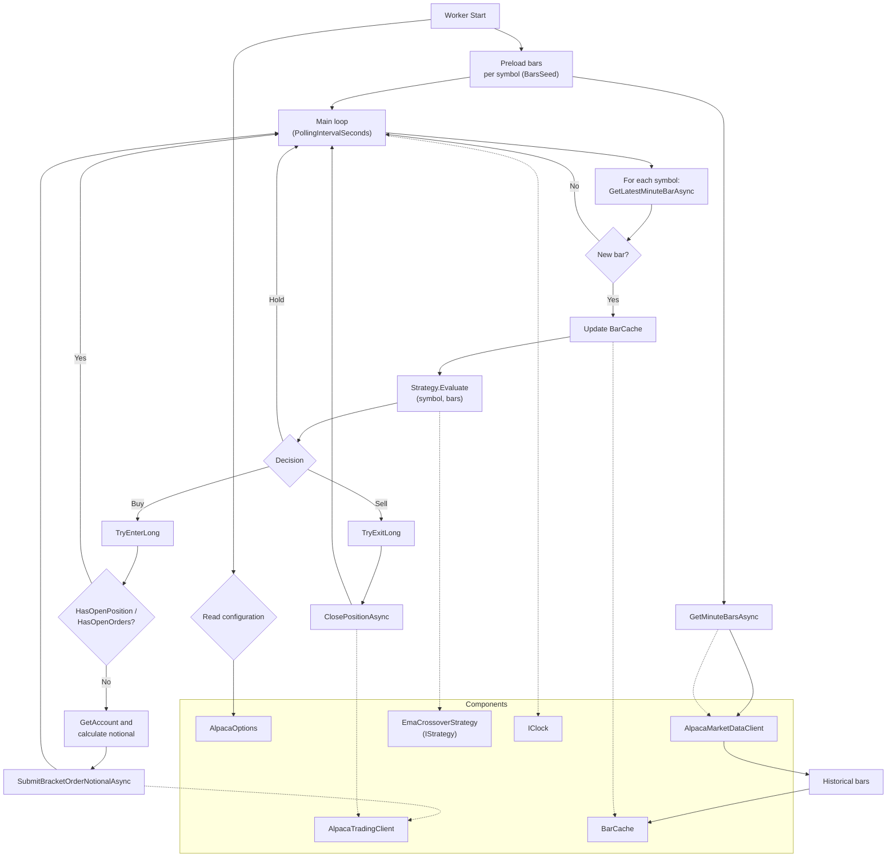

# Divitiae

Divitiae is an automated trading application that analyzes the market and executes buy and sell operations to seek profits.

## Worker Flow

The `Worker` is a background service (.NET 8 `BackgroundService`) that:

- Preloads 1-minute bars for each configured symbol.
- In a periodic loop, gets the latest market bar, updates the `BarCache` and evaluates an `IStrategy`.
- Based on the decision (`Hold`, `Buy`, `Sell`), sends a bracket buy order or closes the position.



## Configuration

Alpaca configuration is bound to `AlpacaOptions` and read from `appsettings.json` (and overrides via environment variables or secrets). When the market is closed, the worker skips symbol processing and waits 15 minutes before the next cycle; when open, it uses `PollingIntervalSeconds`.

### AlpacaOptions fields

- `ApiKeyId` : Alpaca API Key ID. Do not store in `appsettings.json`.
- `ApiSecretKey` : Alpaca API Secret Key. Do not store in `appsettings.json`.
- `TradingApiBaseUrl`: Trading API base URL (paper/live). Example: `https://paper-api.alpaca.markets`.
- `MarketDataApiBaseUrl`: Market data API base URL. Example: `https://data.alpaca.markets`.
- `MarketDataFeed`: Market data feed. `iex` (free) or `sip` (paid).
- `Symbols`: Array of symbols to scan/trade.
- `EmaShortPeriod`: Short EMA period used by the strategy.
- `EmaLongPeriod`: Long EMA period used by the strategy.
- `PositionNotionalFraction`: Fraction of account equity to aim for when entering a position (0.10 = 10%).
- `MinNotionalUsd`: Minimum notional in USD for any order.
- `TakeProfitPercent`: Take-profit percent (0.02 = +2%).
- `StopLossPercent`: Stop-loss percent (0.01 = -1%).
- `TrailingStopPercent`: Trailing stop percent for protective exits.
- `PollingIntervalSeconds`: Polling cadence while market is open.
- `BarsSeed`: Number of 1-minute bars to preload per symbol on startup.
- `TimeInForce`: Order time-in-force, e.g. `gtc`, `day`.

### JSON example (appsettings.json)

```json
{
  "Alpaca": {
    "ApiKeyId": "API_KEY_ID",
    "ApiSecretKey": "API_SECRET_KEY",
    "TradingApiBaseUrl": "https://paper-api.alpaca.markets",
    "MarketDataApiBaseUrl": "https://data.alpaca.markets",
    "MarketDataFeed": "iex",
    "Symbols": [ "AAPL", "MSFT", "SPY" ],
    "EmaShortPeriod": 5,
    "EmaLongPeriod": 20,
    "PositionNotionalFraction": 0.10,
    "MinNotionalUsd": 1.0,
    "TakeProfitPercent": 0.02,
    "StopLossPercent": 0.01,
    "TrailingStopPercent": 0.01,
    "PollingIntervalSeconds": 15,
    "BarsSeed": 100,
    "TimeInForce": "gtc"
  }
}
```
