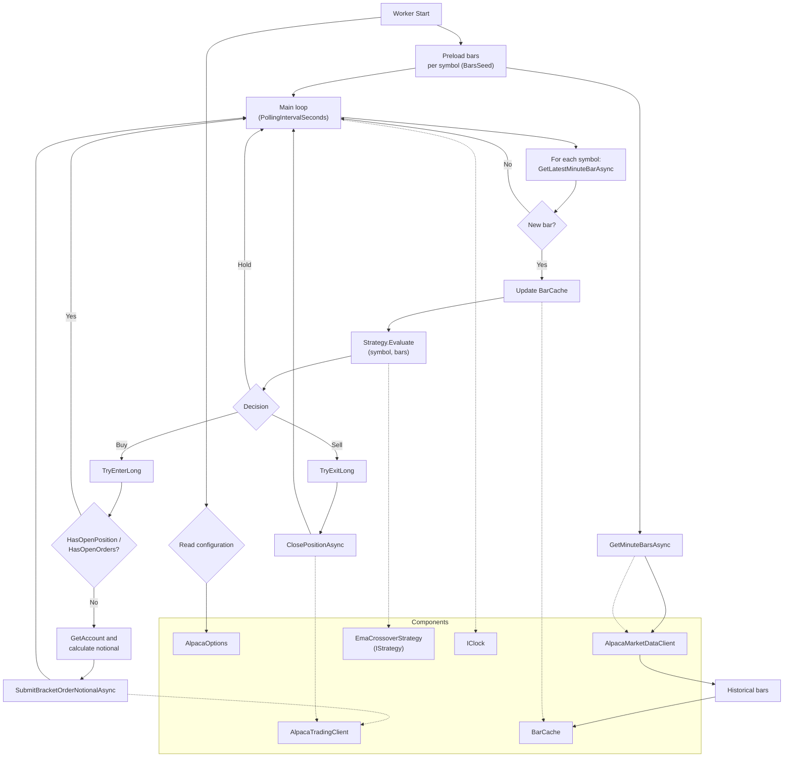

# Divitiae

Divitiae is an automated trading application that analyzes the market and executes buy and sell operations to seek profits.

## Worker Flow

The `Worker` is a background service (.NET 8 `BackgroundService`) that:

- Preloads 1-minute bars for each configured symbol.
- In a periodic loop, gets the latest market bar, updates the `BarCache` and evaluates an `IStrategy`.
- Based on the decision (`Hold`, `Buy`, `Sell`), sends a bracket buy order or closes the position.

### Relevant Configuration Parameters (`AlpacaOptions`)

- `Symbols`: list of symbols to scan/trade.
- `BarsSeed`: number of initial bars for preload.
- `PollingIntervalSeconds`: interval of the polling loop.
- `MarketDataFeed`: data feed for market data.
- `PositionNotionalFraction` and `MinNotionalUsd`: entry notional calculation.
- `TakeProfitPercent` and `StopLossPercent`: bracket levels.
- `TimeInForce`: TIF for orders.

### Key Components

- `Worker` (BackgroundService): orchestrates the flow.
- `AlpacaMarketDataClient`: gets 1m bars and latest bars.
- `BarCache`: stores and trims bars by symbol.
- `IStrategy` (`EmaCrossoverStrategy`): decides `Hold/Buy/Sell`.
- `AlpacaTradingClient`: queries account, positions/orders and sends bracket/close orders.
- `IClock`: temporal reference for loop timing.
